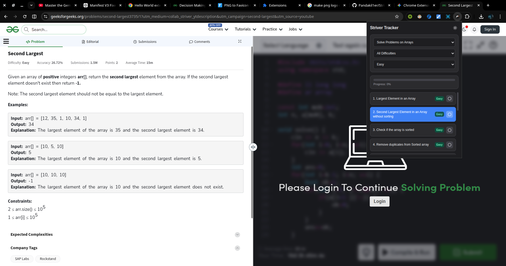

# 🚀 Striver A2Z Problem Tracker (Chrome Extension)

A sleek, lightweight, and dark-mode-enabled Chrome Extension designed to help students track their progress through the popular Striver A2Z DSA Sheet. Say goodbye to losing your place or juggling multiple browser tabs!

> **⚠️ DISCLAIMER: Unofficial Community Tool**
> This extension is an unofficial, community-built tool and is **NOT** affiliated with, endorsed by, or associated with Raj Vikramaditya (Striver) or the TakeUForward platform.
>
> The Striver A2Z DSA curriculum is the intellectual property of TakeUForward. This extension merely acts as a bookmarking and tracking interface for the publicly available syllabus. All problem curation and educational credit go entirely to Striver. Please support the original creator by visiting [TakeUForward.org](https://takeuforward.org/) and his [YouTube Channel](https://www.youtube.com/@takeUforward).

---

## ✨ Features

- **📊 Visual Progress Tracking:** Watch your progress bar fill up as you crush Data Structures and Algorithms.
- **🌙 True Dark Mode:** Easy on the eyes for those late-night coding sessions, with a persistent theme toggle.
- **🔍 Smart Filtering:** Instantly filter problems by Topic, Subtopic, and Difficulty (Easy, Medium, Hard).
- **💾 Local Storage Sync:** Your solved problems and current position are saved locally in your browser—no login required.
- **🎯 Quick Navigation:** Jump straight to the problem on platforms like LeetCode or GeeksforGeeks with a single click.

## ⌨️ Keyboard Shortcuts

Navigate through the Striver sheet without taking your hands off the keyboard!

- `Alt + N` : Go to the **Next** problem
- `Alt + P` : Go to the **Previous** problem
- `Alt + S` : **Toggle** the solved state of the current problem
- `Alt + Shift + S` : Explicitly **Mark as solved**

_(Note: On Mac, use the `Option` key instead of `Alt`)_

## 🛠️ Installation (Developer Mode)

While this extension is pending approval on the Chrome Web Store, you can install it manually in seconds:

1. **Download the code:** Click the green **Code** button at the top of this repository and select **Download ZIP**. (Or clone the repository via terminal).
2. **Extract the folder:** Unzip the downloaded file to an easily accessible location on your computer.
3. **Open Chrome Extensions:** Open Google Chrome and navigate to `chrome://extensions/`.
4. **Enable Developer Mode:** Toggle the **Developer mode** switch in the top right corner to ON.
5. **Load the Extension:** Click the **Load unpacked** button that appears in the top left corner.
6. **Select the Folder:** Browse to where you extracted the code, select the folder, and click open.

_Tip: Click the puzzle piece icon in Chrome to pin the tracker to your toolbar for easy access!_

## 💻 Tech Stack

- **HTML5 / CSS3:** Utilizing CSS variables for seamless theme switching.
- **Vanilla JavaScript:** Fast, dependency-free DOM manipulation and state management.
- **Chrome Extension API:** Utilizing `chrome.storage.local` for persistence and `chrome.tabs` for navigation.

## 🤝 Contributing

Contributions, issues, and feature requests are welcome! Feel free to check the issues page. If you want to add new features or fix a bug:

1. Fork the Project
2. Create your Feature Branch (`git checkout -b feature/AmazingFeature`)
3. Commit your Changes (`git commit -m 'Add some AmazingFeature'`)
4. Push to the Branch (`git push origin feature/AmazingFeature`)
5. Open a Pull Request

## 📄 License

Distributed under the MIT License. See `LICENSE` for more information.

_(Note: This license applies only to the code of this extension, not the curated dataset of problems which belongs to TakeUForward)._
